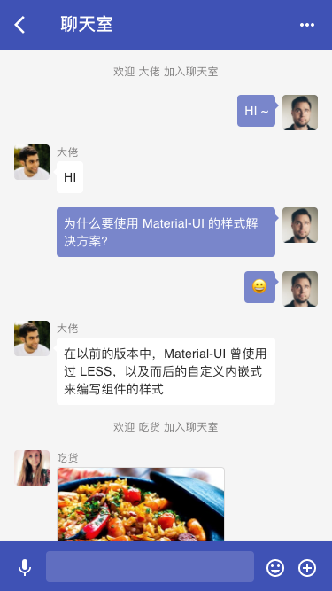
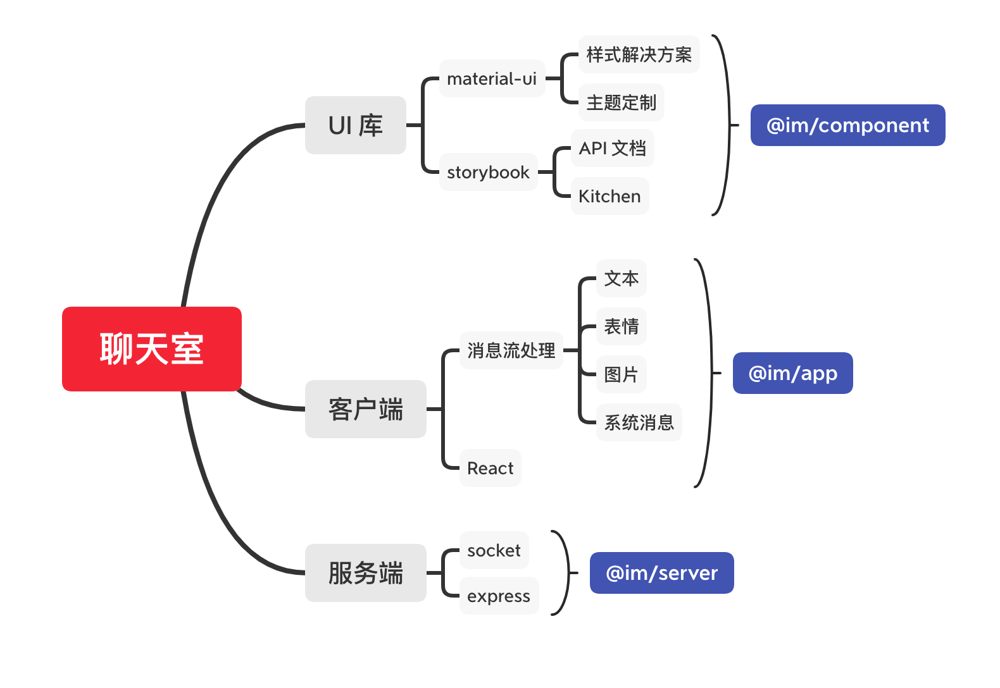
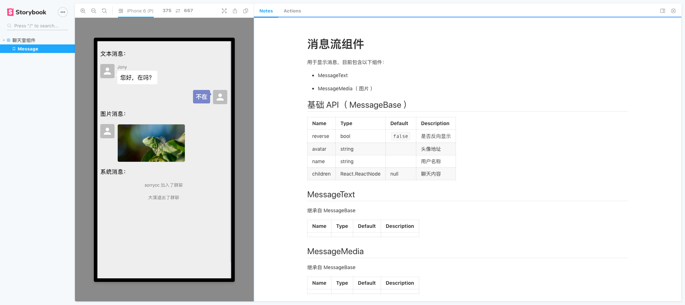
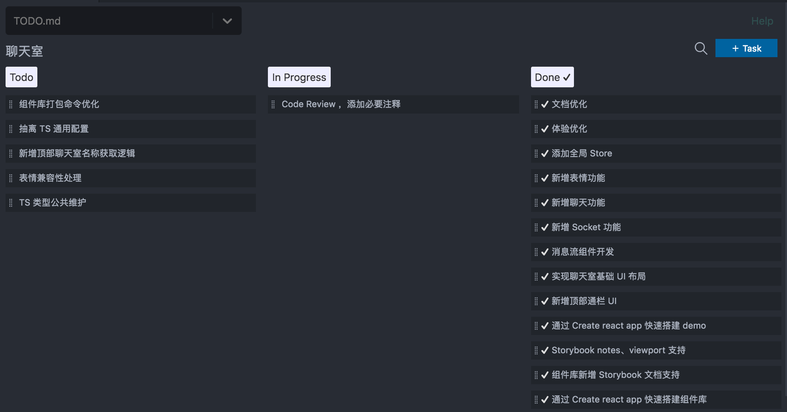

# 如何快速开发聊天室

当雨季来临的时候，意味着要宅在家里做点什么。

接下来，带着大家快速开发一个 Web 版聊天室。心急的小伙伴可以直接看[源码](https://github.com/leer0911/im)

PS：该教程面向**有一定 React、TS 、Node 经验的前端开发者**，通过学习您将获得：

- UI 组件库搭建
- Lerna + monorepo 的开发模式
- 基于 React hook 的状态管理
- socket.io 在客户端和服务端的应用

## 目标

**实现多人在线聊天，可发送文本、表情、图片。**

接着来看下我们要实现的页面长什么样子：



## 开发计划与项目初始化

通过需求分析后，制定如下开发计划：



### 基础配置

基础配置是通过自研脚手架快速搭建的，其中包括：

1. 添加 eslint、prettier、husky 用于代码规范、git 提交规范
2. 添加 Lerna 配置，yarn workspaces
3. 在 packages 目录建立 `@im/component`、`@im/app`、`@im/server` 包

> 这里说明下，个人习惯在用 TS 时，将 `prettier` 的 `printWidth` 设置为 120 (标准是 80)。目的是，能用一行代码表达的，绝不用两行，代码格式化造成的也不行。

接着分别介绍每个包的具体细节

### UI 库

秉承快速开发的节奏，直接采用 create-react-app cli 初始化 UI 库。命令如下：

1. 初始化 React+TS 环境

```bash
npx create-react-app component --typescript
```

2. 初始化 Storybook

```bash
cd component
npx -p @storybook/cli sb init --story-format=csf-ts
```

3. 添加 storybook addons

```js
{
  addons: [
    '@storybook/preset-create-react-app',
    '@storybook/addon-viewport', // 手机预览效果
    '@storybook/addon-notes/register-panel', // API 文档
    '@storybook/addon-actions',
    '@storybook/addon-links',
  ],
};
```

最终以这种模式去规范组件库的开发（PS：**没有文档的组件库，不叫组件库**）：



### 客户端

APP 的开发采用我们最熟悉的模式，直接用 create-react-app 初始化环境。

```bash
npx create-react-app app --typescript
```

整个聊天室项目采用的是多包管理模式，所以在开发时我们会直接通过 `lerna link` 命令来创建软连接，因此可以不必通过发布包来完成依赖的使用。

但这里要注意的是，**由于 `create react app` 命令生成的项目中 babel 配置是忽略编译 `node_modules` 的。所以，不得不覆盖其 webpack 配置**。

这里简单通过 `react-app-rewired` 到方式来达成目的，但并不是最佳实践。

### 服务端

这里，服务端的代码，仅作为辅助演示的作用，因此暂不考虑健壮性。标配 `ts-node`、`nodemon`、`express` 即可满足需求。

启动命令如下：

```bash
nodemon --watch 'src/**/*.ts' --ignore 'src/**/*.spec.ts' --exec 'ts-node' src/index.ts
```

## 核心实现

至此，基本的环境以及搭建完毕。接下来讲下聊天室核心实现逻辑

大家可以用个 TODO 的方式进行开发，比如：



把需求拆分成若干个任务，每个任务关联到一个 TODO，并以此规范 git commit。

### 消息组件设计

虽然项目是基于 Material-UI 开发的，但考虑到业务带来的差异性，组件库可能需要高度定制，故直接采用全量导出的方式来使用基础 UI 组件。

聊天室用到比较多是消息流组件，比如：纯文本消息组件，纯图片消息组件，系统消息组件，推荐组件等。

```bash
├── MessageBase.tsx # 包含头像、反向显示的基础消息组件
├── MessageMedia.tsx # 图片、音频等
├── MessageSystem.tsx # 系统消息
├── MessageText.tsx # 文本组件
├── __stories__ # 文档相关
│   ├── Demo.tsx
│   ├── Message.stories.tsx
│   ├── README.md
│   └── img.jpg
└── index.tsx
```

主要的设计思路：

1. 以组合的方式开发组件
2. 保持组件 API 一致性
3. 尽可能简单，不过度设计

目前需要实现的消息组件比较简单，具体实现，可以看源码。这里主要传达的是文件组织方式和基本设计思路。

### 数据流设计

先来看下，React hook 出现后，前端可以如何更优雅地共享状态

```ts
export const ChatContext = React.createContext<{
  state: typeof initialState;
  dispatch: (action: Action) => void;
}>({
  state: initialState,
  dispatch: () => {},
});

export const useChatStore = () => React.useContext(ChatContext);

export function ChatProvider(props: any) {
  const [state, dispatch] = React.useReducer(reducer, initialState);
  const value = { state, dispatch };
  return <ChatContext.Provider value={value}>{props.children}</ChatContext.Provider>;
}
```

1. 通过 `React.createContext` 创建 context
2. 通过 `React.useReducer` 管理 reducer，生成 state 与 dispatch
3. 通过 `React.useContext` 获取状态源

这样，我们就可以很方便的维护局部或全局状态。至于是否要将所有的状态都放到根状态树里以及 domain 数据是否需要状态化，就是另外一个故事了，这里就留给读者自己去深究。

接着我们来设计一个聊天室所需的数据结构：

```ts
interface State {
  messages: Message[]; // 数组的方式存储所有消息，保持有序
  members: { [id: string]: Member }; // map 的形式存储当前聊天室所有用户，便于查询
}
```

数据尽可能地保持简单，比如一个 message 的结构可以是这样：

```ts
interface Message {
  id: string;
  type: MESSAGE_TYPE; // 消息类型，用于渲染不用的消息组件
  userId: string; // 发送消息的用户标识
  content: object; // 根据消息组件类型收敛的数据结构
}
```

`MESSAGE_TYPE` 消息类型枚举，用于与消息流组件隐射一一对应，以及 socket 消息发送时的
type 数据。建议可以在 `@im/helper` 里统一维护这类的常量。

```ts
interface Member {
  id: string;
  avatar: string;
  name: string;
}
```

通过消息中的 `userId` 去 members 获取对应用户数据来渲染头像和用户昵称等。

按以上的约定基本可以满足一个简单的聊天室了。另外，如果组件层级比较多，组件粒度拆得比较细的话，在不考虑业务组件复用的情况下，可以引入一些共享状态，如：currentUserId、socket、activeTool 等，可有效避免父子组件状态传达，但这里需要开发者自行权衡复用性。

### 客户端 Socket

1. 组件挂载完成后，建立 socket 链接，并保存当前 socket 实例，卸载后记得断开连接。

```tsx
React.useEffect(() => {
  const socket: SocketIOClient.Socket = io('http://localhost:3002');
  dispatch({ type: Type.INSERT_SOCKET, payload: socket });
  return () => {
    socket.close();
  };
}, [dispatch]);
```

2. 通过以下方式通知服务端，比如用户加入聊天室

```ts
state.socket.emit('add user', username);
```

3. 监听服务端事件，比如用户发送消息

```ts
React.useEffect(() => {
  if (!state.socket) {
    return;
  }
  state.socket.removeAllListeners();

  state.socket.on('login', handleLogin);
  state.socket.on('user joined', handleUserJoin);
  state.socket.on('user left', handleUserLeft);
  state.socket.on('new message', handelNewMessage);
}, [state.socket, handleLogin, handleUserJoin, handelNewMessage, handleUserLeft]);
```

### 服务端 Socket

这是一个 socket 官方的 demo，比较简单。不考虑其他的场景，这样就可以了！

```ts
import express from 'express';
import socket from 'socket.io';
const server = require('http').createServer(app);
const io = socket(server);

server.listen(port);

io.on('connection', socket => {
  // 处理接收的新消息
  socket.on('new message', data => {
    // 通知其他客户端
    socket.broadcast.emit('new message', {
      id: v4(),
      username: socket.username,
      userId: socket.userId,
      message: data.message,
      type: data.type,
    });
  });
});
```

客户端和服务端的 socket 已经完成通信，贴代码总是很累的，具体细节参看源码。

## QA

这一节我通过问答的方式来快速过一下开发聊天室中可能遇到的问题：

1. 如何实现表情发送

简单的表情可以当做文本来处理，如果需要考虑兼容性的话，可以用图片。这里不做具体展开

2. 如何滚动到最新消息

```ts
React.useEffect(() => {
  if (lastMessage) {
    // 获取最后一个消息元素
    lastMessage.scrollIntoView();
  }
}, [lastMessage]);
```

## 总结

快速的带大家实现了一个简易的 Web 版聊天室，从需求分析，到代码规范组织，在到数据流设计，最后介绍了 socket 在客户端和服务端的应用，想必大家对**如何快速开发聊天室**也有了大致的认识。希望本教程有帮助到大家，谢谢。
